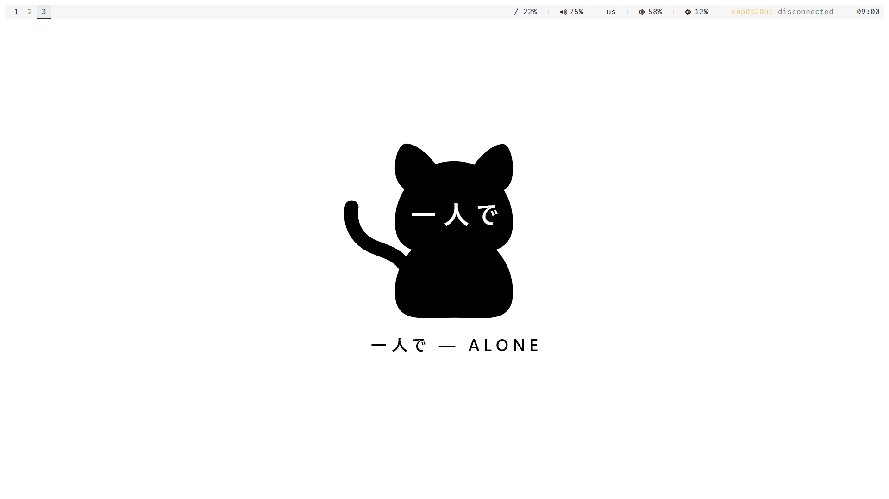
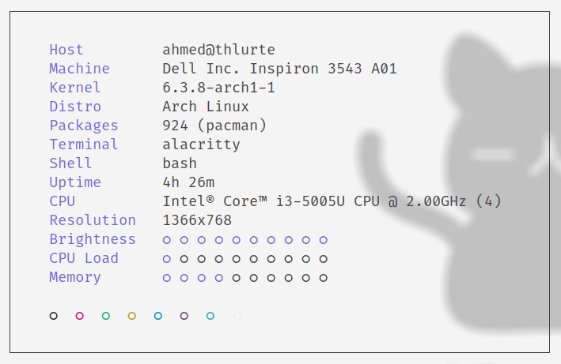
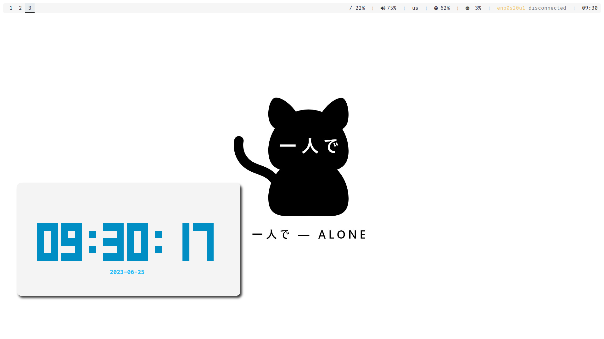
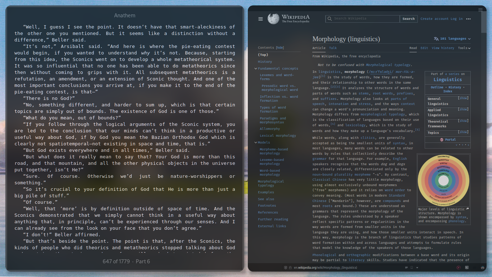

  <b> ~ i3 dotfiles ~ </b>

    

    
        
    </a>

 
A bunch of tweaks i made to make her appearance pretty much aesthetic..
 

## Info

|Distro|[Arch](https://archlinux.org/)|
|:---:|:---:|
|WM|[i3](https://github.com/i3/i3)|
|Bar|[Polybar](https://github.com/polybar/polybar)|
|Menu|[Rofi](https://github.com/davatorium/rofi)|
|Compositor|[Picom](https://archlinux.org/packages/community/x86_64/picom/)|
|Terminal|[Alacritty](https://github.com/alacritty/alacritty)|
|File Manager|[Nautilus](https://github.com/GNOME/nautilus)|
|Shell|[Bash](https://archlinux.org/packages/core/x86_64/bash/)|
|Aur Helper|[Yay](https://github.com/Jguer/yay)|

 

<table align="center">
   <tr>
      <th align="center">
         :warning: WARNING :warning:
      </th>
   </tr>
   <tr>
      <td align="center">

      
      
     THIS DOTFILES ARE CONFIGURED AT 1920x1080 WITH 96 DPI! 1 MONITOR
     SOME STUFF MIGHT BREAK ON LOWER OR HIGHER
     RESOLUTIONS OR YOU HAVE TO PLAY WITH IT.
     
   </tr>
   </table>

## Preview

 
 

 
 

