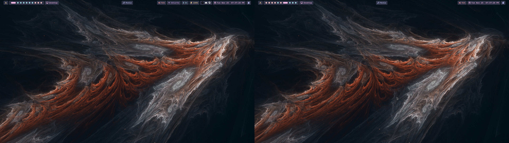
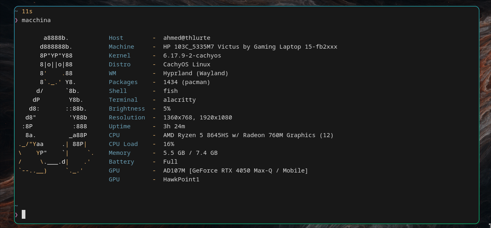
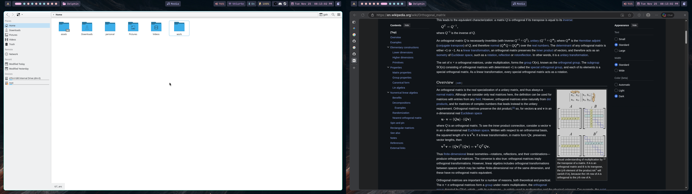

  <b> ~ Hyprland dotfiles ~ </b>

    

    
        
    </a>

 
A bunch of tweaks i made to make her appearance pretty much aesthetic..
 

## Info

|Distro|[Arch](https://archlinux.org/)|
|:---:|:---:|
|WM|[Hyprland](https://hyprland.org/)|
|Bar|[Hyprpanel](https://github.com/hyprwm/hyprpanel)|
|Menu|[Wofi](https://hg.sr.ht/~scoopta/wofi)|
|Terminal|[Kitty](https://github.com/kovidgoyal/kitty)|
|Editor|[Neovim](https://neovim.io/) (Kickstart.nvim)|
|File Manager|[Dolphin](https://apps.kde.org/dolphin/)|
|Shell|[Fish](https://fishshell.com/)|
|Wallpaper|[Hyprpaper](https://github.com/hyprwm/hyprpaper)|

 

<table align="center">
   <tr>
      <th align="center">
         :warning: WARNING :warning:
      </th>
   </tr>
   <tr>
      <td align="center">

      
      
     THIS DOTFILES ARE CONFIGURED FOR DUAL MONITOR SETUP:
     - Laptop (eDP-1): 1920x1080@144Hz
     - TV (HDMI-A-1): 1920x1080@60Hz
     SOME STUFF MIGHT BREAK ON DIFFERENT
     RESOLUTIONS OR YOU HAVE TO PLAY WITH IT.
     
   </tr>
   </table>

## Preview

 
 

 
 

 
 

## Keybinds

### Basic Navigation
| Keybind | Action |
|:---:|:---:|
| `Super + Q` | Open terminal (Kitty) |
| `Super + C` | Close active window |
| `Super + M` | Exit Hyprland |
| `Super + E` | Open file manager (Dolphin) |
| `Super + R` | Application launcher (Wofi) |
| `Super + V` | Toggle floating window |
| `Super + P` | Toggle pseudotile |
| `Super + J` | Toggle split direction |
| `Super + Arrow Keys` | Move focus between windows |

### Workspaces
| Keybind | Action |
|:---:|:---:|
| `Super + 1-0` | Switch to workspace 1-10 (Laptop) |
| `Super + Shift + 1-0` | Move window to workspace 1-10 |
| `Super + F1-F10` | Switch to workspace 11-20 (TV) |
| `Super + Shift + F1-F10` | Move window to workspace 11-20 |
| `Super + S` | Toggle special workspace (scratchpad) |
| `Super + Shift + S` | Move window to special workspace |
| `Super + Mouse Scroll` | Scroll through workspaces |
| `Super + Ctrl + Left/Right` | Navigate workspaces on Laptop |
| `Super + Shift + Left/Right` | Navigate workspaces on TV |
| `Super + Alt + Shift + Left/Right` | Move window to next/prev workspace |

### Monitor Management
| Keybind | Action |
|:---:|:---:|
| `Super + Alt + Right` | Move window to right monitor (TV) |
| `Super + Alt + Left` | Move window to left monitor (Laptop) |

### Floating Windows
| Keybind | Action |
|:---:|:---:|
| `Super + T` | Open floating terminal (Alacritty) |
| `Super + F` | File search with fzf (opens in Neovim) |
| `Super + Shift + F` | Text search inside files |
| `Super + G` | Gemini context selector |

### Screenshots & Clipboard
| Keybind | Action |
|:---:|:---:|
| `Super + X` | Screenshot full screen (save) |
| `Super + Shift + X` | Screenshot area (copy to clipboard) |
| `Super + Alt + X` | OCR (select area → copy text) |
| `Print` | Copy full screen to clipboard |
| `Super + H` | Open clipboard history |

### Media & System
| Keybind | Action |
|:---:|:---:|
| `XF86AudioRaiseVolume` | Increase volume |
| `XF86AudioLowerVolume` | Decrease volume |
| `XF86AudioMute` | Toggle mute |
| `XF86AudioMicMute` | Toggle microphone mute |
| `XF86MonBrightnessUp` | Increase brightness |
| `XF86MonBrightnessDown` | Decrease brightness |
| `XF86AudioNext` | Next track |
| `XF86AudioPrev` | Previous track |
| `XF86AudioPlay/Pause` | Play/Pause |

### Mouse
| Keybind | Action |
|:---:|:---:|
| `Super + LMB` | Move window |
| `Super + RMB` | Resize window |
| `3-finger swipe horizontal` | Switch workspaces |

## Dependencies

### Core
- `hyprland` - Wayland compositor
- `hyprpanel` - Status bar
  - **Note**: Install with `paru -S ags-hyprpanel-git`
- `hyprpaper` - Wallpaper daemon
- `hypridle` - Idle daemon

### Applications
- `kitty` - Terminal emulator
- `alacritty` - Terminal (for floating windows)
- `neovim` - Text editor
- `wofi` - Application launcher
- `dolphin` - File manager
- `fish` - Shell
- `obsidian` - Note-taking app
- `cursor` - Code editor (VSCode fork)

### Utilities
- `grimblast` - Screenshot utility
- `grim` - Screenshot tool
- `slurp` - Region selection
- `cliphist` - Clipboard history manager
- `wl-paste` - Wayland clipboard utility
- `playerctl` - Media player control
- `brightnessctl` - Brightness control
- `wpctl` - WirePlumber audio control
- `fzf` - Fuzzy finder
- `ripgrep` - Text search tool
- `tesseract` - OCR engine

## Workspace Layout

### Laptop Monitor (eDP-1) - Workspaces 1-10
- Workspace 8: Discord
- Workspace 9: Microsoft Teams
- Workspace 10: Steam

### TV Monitor (HDMI-A-1) - Workspaces 11-20
- Workspace 11-12: Obsidian
- Workspace 13: Alacritty
- Workspace 14: Cursor
- Workspace 16: Microsoft Edge

## Misc.

- Font : [CaskaydiaCove Nerd Font Mono](https://github.com/ryanoasis/nerd-fonts) (`ttf-cascadia-code-nerd` from pacman)
  - Applied to Obsidian and VSCode
- Cursor : [Phinger Cursors](https://github.com/phisch/phinger-cursors)
- Neovim : [Kickstart.nvim](https://github.com/nvim-lua/kickstart.nvim)
- VSCode Theme : [Catppuccin for VSCode](https://github.com/catppuccin/vscode)
- VSCode Icons : [Catppuccin Icons for VSCode](https://github.com/catppuccin/vscode)
- Hyprpanel Theme : Catppuccin Frappe (based on Hyprpanel colors)

