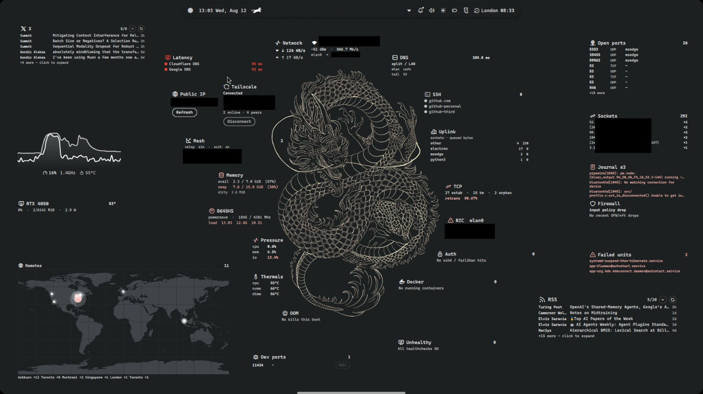
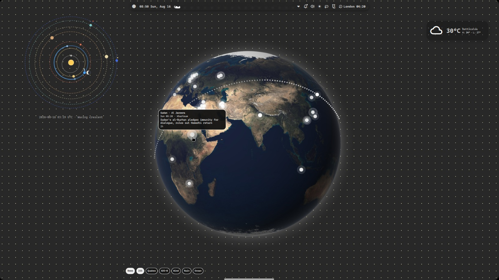
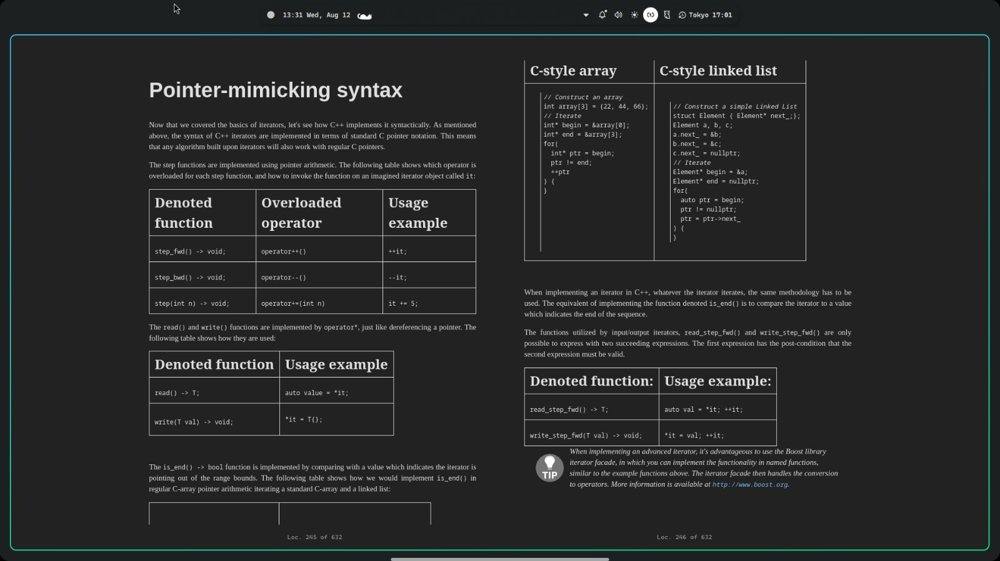
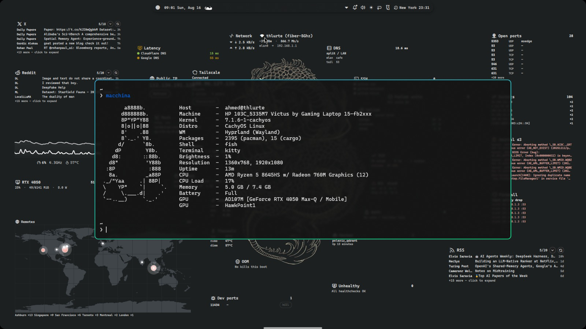
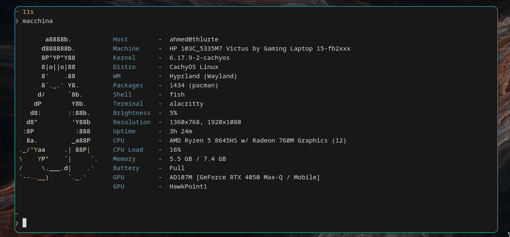

<p align="center">
  <b>~ Hyprland + Noctalia dotfiles ~</b>
</p>

<div align="center">
  <a href="https://github.com/thlurte/dots/stargazers">
    
  </a>
  <a href="https://github.com/thlurte/dots/network/members">
    
  </a>
</div>

<br/>

Personal desktop config for a dual-monitor CachyOS / Arch laptop. Window management is **Hyprland**; the bar, launcher, notifications, and floating desktop widgets are **Noctalia Shell** on Quickshell (`qs -c noctalia-shell`).

Configs under `~/.config/<app>` are symlinked into this repo so the machine and git stay in sync.

---

## Stack

| Piece | Choice |
|:---:|:---|
| Distro | [CachyOS](https://cachyos.org/) (Arch) |
| WM | [Hyprland](https://hyprland.org/) `0.56.x` |
| Shell UI | [Noctalia Shell](https://github.com/noctalia-dev/noctalia-shell) via Quickshell |
| Terminal | [Kitty](https://sw.kovidgoyal.net/kitty/) (Alacritty also present) |
| Font (terminal) | **CaskaydiaCove Nerd Font** (`ttf-cascadia-code-nerd`), size `12.5`, opacity `0.88` |
| Editor | [Neovim](https://neovim.io/) — Kickstart-based, **tokyonight-night** |
| Shell | [Fish](https://fishshell.com/) |
| File manager | [Dolphin](https://apps.kde.org/dolphin/) |
| Wallpaper | [Hyprpaper](https://github.com/hyprwm/hyprpaper) |
| Lock / idle | hyprlock + hypridle |
| Theming | [Matugen](https://github.com/InioX/matugen) + Noctalia color pipeline |
| Launcher | Noctalia IPC (`Super+Space`) / Fuzzel config kept |
| Screenshots | Flameshot + grim/slurp OCR bind |

**Not used anymore:** i3, niri, Hyprpanel (legacy folder kept under `.config/hyprpanel`).

---

## Monitors

Configured in `.config/hypr/hyprland.conf`:

| Output | Role | Mode | Position |
|:---:|:---:|:---:|:---:|
| `eDP-1` | Laptop | `1920×1080@60` | `0×0` |
| `HDMI-A-1` | External / TV | `1920×1080@60` | `1920×0` (right of laptop) |

Desktop widgets live mostly on **eDP-1**. HDMI holds decorative **custom stickers** (images under `assets/stickers/`).

> Change monitor lines if your outputs or Hz differ — widget coordinates assume this layout.

---

## Repository layout

```
dots/
├── README.md
├── assets/
│   ├── demo-*.png          # README screenshots
│   └── stickers/           # Noctalia custom-sticker images (HDMI)
├── .fonts/                 # optional local fonts
├── .wallpaper/
└── .config/                # ← symlinked from ~/.config/
    ├── hypr/               # Hyprland + paper/lock/idle + scripts/shaders
    ├── noctalia/           # Shell settings + all desktop widget plugins
    ├── kitty/
    ├── alacritty/
    ├── fish/
    ├── nvim/
    ├── fuzzel/
    ├── matugen/
    ├── btop/
    ├── micro/
    └── hyprpanel/          # unused legacy bar
```

### Symlinks

On this machine:

```text
~/.config/hypr      → ~/personal/dots/.config/hypr
~/.config/noctalia  → ~/personal/dots/.config/noctalia
~/.config/kitty     → ~/personal/dots/.config/kitty
~/.config/alacritty → ~/personal/dots/.config/alacritty
~/.config/fish      → ~/personal/dots/.config/fish
~/.config/nvim      → ~/personal/dots/.config/nvim
~/.config/fuzzel    → ~/personal/dots/.config/fuzzel
~/.config/matugen   → ~/personal/dots/.config/matugen
~/.config/btop      → ~/personal/dots/.config/btop
~/.config/micro     → ~/personal/dots/.config/micro
```

---

## Hyprland

**Autostart**

```conf
exec-once = touch /tmp/hypr_grayscale_active
exec-once = qs -c noctalia-shell
```

### Grayscale (on by default)

The desktop boots in **grayscale**. Two things make that stick:

1. `decoration:screen_shader` points at `.config/hypr/shaders/grayscale.glsl` in `hyprland.conf`
2. `exec-once = touch /tmp/hypr_grayscale_active` creates the state file the toggle script expects, so the first `Super+G` turns color **on** (shader off), and the next press returns to grayscale

| | |
|:---|:---|
| Shader | `.config/hypr/shaders/grayscale.glsl` |
| State file | `/tmp/hypr_grayscale_active` (present = grayscale on) |
| Toggle | `Super + G` → `.config/hypr/scripts/toggle_grayscale.sh` |
| Default at login | **Grayscale enabled** |

To start in color instead: remove the `screen_shader` line and the `touch /tmp/hypr_grayscale_active` exec-once (or invert the script logic).

Extra pieces under `.config/hypr/`:

| File / dir | Purpose |
|:---|:---|
| `hyprland.conf` | Monitors, binds, look & feel |
| `hyprpaper.conf` | Wallpapers |
| `hyprlock.conf` | Lock screen |
| `hypridle.conf` | Idle / DPMS |
| `colors.conf` | Shared colors |
| `shaders/` | e.g. grayscale shader |
| `scripts/` | grayscale toggle, battery, ollama helpers, project manager |

---

## Noctalia Shell

Runtime: **Quickshell**, config name `noctalia-shell`.

| File | Role |
|:---|:---|
| `settings.json` | Desktop widget placement, bar, theming, per-monitor layout |
| `plugins.json` | Which plugins are enabled |
| `plugins/<id>/` | Plugin code (`DesktopWidget.qml`, manifests, settings UIs) |
| `colors.json` / `colorschemes/` | Color state |
| `config.toml` | Leftover / experimental bits (v5 era) — not the active shell path |

Reload Noctalia from the **session menu** when plugins change. Prefer that over `pkill qs` so the bar comes back cleanly.

### Desktop widgets (high level)

Floating cards on **eDP-1**, mostly transparent (`showBackground: false`):

**Network / identity**
- Link status, network indicator, latency, public IP, DNS, Tailscale status + mesh, SSH sessions, uplink / bandwidth-by-process, open ports, conntrack remotes, socket world map (GeoIP)

**Ops / security**
- Failed systemd units, journal errors, nftables/firewall summary, auth failures, NIC errors, OOM kills, watched dev ports

**Compute**
- PSI pressure, TCP health, NVIDIA RTX 4050, AMD 760M, memory/swap, CPU clocks/load, thermals, Docker health, Ollama

**Feeds**
- RSS (add URLs in widget settings; click to open; expand for full list)
- X / Twitter via [`bird`](https://bird.fast) + Chrome cookies (handle list in settings; cached + rate-limit aware)

**HDMI**
- `custom-sticker` images from `assets/stickers/`

Community / utility plugins also installed (world-clock, catwalk, visualizer, hot-corners, battery-monitor-plus, …). Enable flags live in `plugins.json`.

### Twitter / RSS notes

- RSS: Python fetcher in `plugins/rss-feeds/fetch.py`
- Twitter: `plugins/twitter-feeds/fetch.py` calls `~/.npm-global/bin/bird`; needs you logged into x.com in Chrome; rotates accounts to avoid HTTP 429

---

## Kitty

Overrides at the bottom of `.config/kitty/kitty.conf` (after Noctalia theme includes):

```conf
font_family      CaskaydiaCove Nerd Font
font_size 12.5
background_opacity 0.88
dynamic_background_opacity yes
window_padding_width 8
```

Package: `ttf-cascadia-code-nerd`. Reload with `Ctrl+Shift+F5` or a new window.

---

## Neovim

Kickstart-style config in `.config/nvim/`.

- Colorscheme: **`tokyonight-night`**
- Leader: `Space`
- Nerd Font assumed (`vim.g.have_nerd_font = true`)

---

## Keybinds

`$mainMod` = `Super`. Source of truth: `.config/hypr/hyprland.conf`.

### Apps & system

| Bind | Action |
|:---:|:---|
| `Super + Q` | Kitty |
| `Super + C` | Kill active window |
| `Super + M` | Exit Hyprland |
| `Super + E` | Dolphin |
| `Super + Space` | Noctalia launcher |
| `Super + R` | Noctalia clipboard launcher |
| `Super + V` | Toggle floating |
| `Super + P` | Float + pin |
| `Super + G` | Toggle grayscale (default: **on** at login) |
| `Print` / `Super+Shift+S` | Flameshot GUI → clipboard |
| `Alt+Shift+S` | Region OCR → clipboard |

### Windows & workspaces

| Bind | Action |
|:---:|:---|
| `Super + Arrows` | Move focus |
| `Super + 1…0` | Workspace 1–10 |
| `Super + Shift + 1…0` | Move window to workspace |
| `Super + Shift + Left/Right` | Prev / next workspace |
| `Super + Mouse wheel` | Cycle workspaces |
| `Super + LMB / RMB` | Move / resize window |

### Hardware keys

Volume / mute / mic / brightness / media via `wpctl`, `brightnessctl`, `playerctl`.

---

## Install / restore

1. Clone to `~/personal/dots` (or adjust symlink targets).
2. Symlink the `.config/*` folders you want into `~/.config/`.
3. Install at least:
   - Hyprland, hyprpaper, hyprlock, hypridle
   - Quickshell + Noctalia Shell
   - Kitty, Fish, Neovim
   - `ttf-cascadia-code-nerd`
   - Optional: Matugen, Fuzzel, Flameshot, `bird` (`npm i -g @steipete/bird`) for the X widget
4. Set Hyprland autostart to `qs -c noctalia-shell`.
5. Edit monitor lines and widget `x`/`y` if your layout differs.
6. For stickers, keep images under `assets/stickers/` — paths in `noctalia/settings.json` point there.

---

## Preview


<br/><br/>

<br/><br/>
<p align="center">
  <b>~ Hyprland + Noctalia dotfiles ~</b>
</p>

<div align="center">
  <a href="https://github.com/thlurte/dots/stargazers">
    
  </a>
  <a href="https://github.com/thlurte/dots/network/members">
    
  </a>
</div>

<br/>

Personal desktop config for a dual-monitor CachyOS / Arch laptop. Window management is **Hyprland**; the bar, launcher, notifications, and floating desktop widgets are **Noctalia Shell** on Quickshell (`qs -c noctalia-shell`).

Configs under `~/.config/<app>` are symlinked into this repo so the machine and git stay in sync.

---

## Stack

| Piece | Choice |
|:---:|:---|
| Distro | [CachyOS](https://cachyos.org/) (Arch) |
| WM | [Hyprland](https://hyprland.org/) `0.56.x` |
| Shell UI | [Noctalia Shell](https://github.com/noctalia-dev/noctalia-shell) via Quickshell |
| Terminal | [Kitty](https://sw.kovidgoyal.net/kitty/) (Alacritty also present) |
| Font (terminal) | **CaskaydiaCove Nerd Font** (`ttf-cascadia-code-nerd`), size `12.5`, opacity `0.88` |
| Editor | [Neovim](https://neovim.io/) — Kickstart-based, **tokyonight-night** |
| Shell | [Fish](https://fishshell.com/) |
| File manager | [Dolphin](https://apps.kde.org/dolphin/) |
| Wallpaper | [Hyprpaper](https://github.com/hyprwm/hyprpaper) |
| Lock / idle | hyprlock + hypridle |
| Theming | [Matugen](https://github.com/InioX/matugen) + Noctalia color pipeline |
| Launcher | Noctalia IPC (`Super+Space`) / Fuzzel config kept |
| Screenshots | Flameshot + grim/slurp OCR bind |

**Not used anymore:** i3, niri, Hyprpanel (legacy folder kept under `.config/hyprpanel`).

---

## Monitors

Configured in `.config/hypr/hyprland.conf`:

| Output | Role | Mode | Position |
|:---:|:---:|:---:|:---:|
| `eDP-1` | Laptop | `1920×1080@60` | `0×0` |
| `HDMI-A-1` | External / TV | `1920×1080@60` | `1920×0` (right of laptop) |

Desktop widgets live mostly on **eDP-1**. HDMI holds decorative **custom stickers** (images under `assets/stickers/`).

> Change monitor lines if your outputs or Hz differ — widget coordinates assume this layout.

---

## Repository layout

```
dots/
├── README.md
├── assets/
│   ├── demo-*.png          # README screenshots
│   └── stickers/           # Noctalia custom-sticker images (HDMI)
├── .fonts/                 # optional local fonts
├── .wallpaper/
└── .config/                # ← symlinked from ~/.config/
    ├── hypr/               # Hyprland + paper/lock/idle + scripts/shaders
    ├── noctalia/           # Shell settings + all desktop widget plugins
    ├── kitty/
    ├── alacritty/
    ├── fish/
    ├── nvim/
    ├── fuzzel/
    ├── matugen/
    ├── btop/
    ├── micro/
    └── hyprpanel/          # unused legacy bar
```

### Symlinks

On this machine:

```text
~/.config/hypr      → ~/personal/dots/.config/hypr
~/.config/noctalia  → ~/personal/dots/.config/noctalia
~/.config/kitty     → ~/personal/dots/.config/kitty
~/.config/alacritty → ~/personal/dots/.config/alacritty
~/.config/fish      → ~/personal/dots/.config/fish
~/.config/nvim      → ~/personal/dots/.config/nvim
~/.config/fuzzel    → ~/personal/dots/.config/fuzzel
~/.config/matugen   → ~/personal/dots/.config/matugen
~/.config/btop      → ~/personal/dots/.config/btop
~/.config/micro     → ~/personal/dots/.config/micro
```

---

## Hyprland

**Autostart**

```conf
exec-once = touch /tmp/hypr_grayscale_active
exec-once = qs -c noctalia-shell
```

Extra pieces under `.config/hypr/`:

| File / dir | Purpose |
|:---|:---|
| `hyprland.conf` | Monitors, binds, look & feel |
| `hyprpaper.conf` | Wallpapers |
| `hyprlock.conf` | Lock screen |
| `hypridle.conf` | Idle / DPMS |
| `colors.conf` | Shared colors |
| `shaders/` | e.g. grayscale shader |
| `scripts/` | grayscale toggle, battery, ollama helpers, project manager |

---

## Noctalia Shell

Runtime: **Quickshell**, config name `noctalia-shell`.

| File | Role |
|:---|:---|
| `settings.json` | Desktop widget placement, bar, theming, per-monitor layout |
| `plugins.json` | Which plugins are enabled |
| `plugins/<id>/` | Plugin code (`DesktopWidget.qml`, manifests, settings UIs) |
| `colors.json` / `colorschemes/` | Color state |
| `config.toml` | Leftover / experimental bits (v5 era) — not the active shell path |

Reload Noctalia from the **session menu** when plugins change. Prefer that over `pkill qs` so the bar comes back cleanly.

### Desktop widgets (high level)

Floating cards on **eDP-1**, mostly transparent (`showBackground: false`):

**Network / identity**
- Link status, network indicator, latency, public IP, DNS, Tailscale status + mesh, SSH sessions, uplink / bandwidth-by-process, open ports, conntrack remotes, socket world map (GeoIP)

**Ops / security**
- Failed systemd units, journal errors, nftables/firewall summary, auth failures, NIC errors, OOM kills, watched dev ports

**Compute**
- PSI pressure, TCP health, NVIDIA RTX 4050, AMD 760M, memory/swap, CPU clocks/load, thermals, Docker health, Ollama

**Feeds**
- RSS (add URLs in widget settings; click to open; expand for full list)
- X / Twitter via [`bird`](https://bird.fast) + Chrome cookies (handle list in settings; cached + rate-limit aware)

**HDMI**
- `custom-sticker` images from `assets/stickers/`

Community / utility plugins also installed (world-clock, catwalk, visualizer, hot-corners, battery-monitor-plus, …). Enable flags live in `plugins.json`.

### Twitter / RSS notes

- RSS: Python fetcher in `plugins/rss-feeds/fetch.py`
- Twitter: `plugins/twitter-feeds/fetch.py` calls `~/.npm-global/bin/bird`; needs you logged into x.com in Chrome; rotates accounts to avoid HTTP 429

---

## Kitty

Overrides at the bottom of `.config/kitty/kitty.conf` (after Noctalia theme includes):

```conf
font_family      CaskaydiaCove Nerd Font
font_size 12.5
background_opacity 0.88
dynamic_background_opacity yes
window_padding_width 8
```

Package: `ttf-cascadia-code-nerd`. Reload with `Ctrl+Shift+F5` or a new window.

---

## Neovim

Kickstart-style config in `.config/nvim/`.

- Colorscheme: **`tokyonight-night`**
- Leader: `Space`
- Nerd Font assumed (`vim.g.have_nerd_font = true`)

---

## Keybinds

`$mainMod` = `Super`. Source of truth: `.config/hypr/hyprland.conf`.

### Apps & system

| Bind | Action |
|:---:|:---|
| `Super + Q` | Kitty |
| `Super + C` | Kill active window |
| `Super + M` | Exit Hyprland |
| `Super + E` | Dolphin |
| `Super + Space` | Noctalia launcher |
| `Super + R` | Noctalia clipboard launcher |
| `Super + V` | Toggle floating |
| `Super + P` | Float + pin |
| `Super + G` | Toggle grayscale shader |
| `Print` / `Super+Shift+S` | Flameshot GUI → clipboard |
| `Alt+Shift+S` | Region OCR → clipboard |

### Windows & workspaces

| Bind | Action |
|:---:|:---|
| `Super + Arrows` | Move focus |
| `Super + 1…0` | Workspace 1–10 |
| `Super + Shift + 1…0` | Move window to workspace |
| `Super + Shift + Left/Right` | Prev / next workspace |
| `Super + Mouse wheel` | Cycle workspaces |
| `Super + LMB / RMB` | Move / resize window |

### Hardware keys

Volume / mute / mic / brightness / media via `wpctl`, `brightnessctl`, `playerctl`.

---

## Install / restore

1. Clone to `~/personal/dots` (or adjust symlink targets).
2. Symlink the `.config/*` folders you want into `~/.config/`.
3. Install at least:
   - Hyprland, hyprpaper, hyprlock, hypridle
   - Quickshell + Noctalia Shell
   - Kitty, Fish, Neovim
   - `ttf-cascadia-code-nerd`
   - Optional: Matugen, Fuzzel, Flameshot, `bird` (`npm i -g @steipete/bird`) for the X widget
4. Set Hyprland autostart to `qs -c noctalia-shell`.
5. Edit monitor lines and widget `x`/`y` if your layout differs.
6. For stickers, keep images under `assets/stickers/` — paths in `noctalia/settings.json` point there.

---

## Preview


<br/><br/>

<br/><br/>

<br/><br/>


---

## Credits

- [Hyprland](https://hyprland.org/) / hyprpaper / hyprlock / hypridle
- [Noctalia Shell](https://github.com/noctalia-dev/noctalia-shell) + community plugins
- [tokyonight.nvim](https://github.com/folke/tokyonight.nvim)
- Kickstart.nvim lineage for the Neovim base
- [bird](https://bird.fast) for X timelines


<br/><br/>


---

## Credits

- [Hyprland](https://hyprland.org/) / hyprpaper / hyprlock / hypridle
- [Noctalia Shell](https://github.com/noctalia-dev/noctalia-shell) + community plugins
- [tokyonight.nvim](https://github.com/folke/tokyonight.nvim)
- Kickstart.nvim lineage for the Neovim base
- [bird](https://bird.fast) for X timelines
