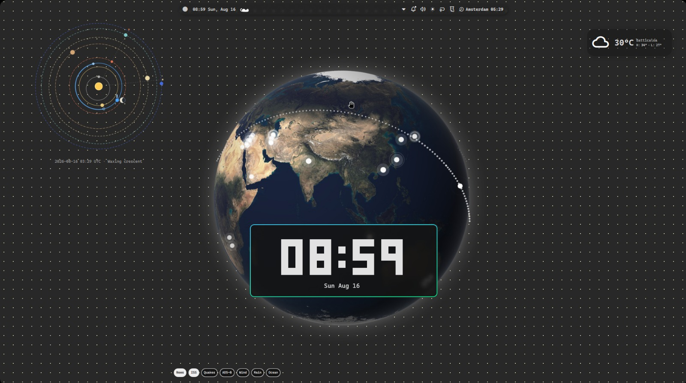

<p align="center">
  <b>~ Hyprland + Noctalia dotfiles ~</b>
</p>

<div align="center">
  <a href="https://github.com/thlurte/dots/stargazers">
    
  </a>
  <a href="https://github.com/thlurte/dots/network/members">
    
  </a>
</div>

<br/>

Personal desktop config for a dual-monitor CachyOS / Arch laptop. Window management is **Hyprland**; the bar, launcher, notifications, and floating desktop widgets are **Noctalia Shell** on Quickshell (`qs -c noctalia-shell`).

Configs are [GNU Stow](https://www.gnu.org/software/stow/) packages. `./stow.sh` links them into `$HOME` (nvim, hypr, fish, …). It does not install software.

---

## Stack

| Piece | Choice |
|:---:|:---|
| Distro | [CachyOS](https://cachyos.org/) (Arch) |
| WM | [Hyprland](https://hyprland.org/) `0.56.x` |
| Shell UI | [Noctalia Shell](https://github.com/noctalia-dev/noctalia-shell) via Quickshell |
| Terminal | [Kitty](https://sw.kovidgoyal.net/kitty/) (Alacritty also present) |
| Font (terminal) | **CaskaydiaCove Nerd Font** (`ttf-cascadia-code-nerd`), size `12.5`, opacity `0.88` |
| Editor | [Neovim](https://neovim.io/) — Kickstart-based, **tokyonight-night** |
| Shell | [Fish](https://fishshell.com/) |
| Fetch | [macchina](https://github.com/Macchina-CLI/macchina) (Fish greeting) |
| TTY clock | [peaclock](https://github.com/octobanana/peaclock) |
| File manager | [Dolphin](https://apps.kde.org/dolphin/) |
| Wallpaper | [Hyprpaper](https://github.com/hyprwm/hyprpaper) |
| Lock / idle | hyprlock + hypridle |
| Theming | [Matugen](https://github.com/InioX/matugen) + Noctalia color pipeline |
| Launcher | Noctalia IPC (`Super+Space`) / Fuzzel config kept |
| Screenshots | Flameshot + grim/slurp OCR bind |

**Not used anymore:** i3, niri, Hyprpanel (legacy package `hyprpanel/`; `./stow.sh -a` to link it).

---

## Monitors

Configured in `hypr/.config/hypr/hyprland.conf` (linked to `~/.config/hypr` by Stow):

| Output | Role | Mode | Position |
|:---:|:---:|:---:|:---:|
| `eDP-1` | Laptop | `1920×1080@60` | `0×0` |
| `HDMI-A-1` | External / TV | `1920×1080@60` | `1920×0` (right of laptop) |

Desktop widgets live mostly on **eDP-1**. HDMI holds decorative **custom stickers** (images under `assets/stickers/`).

> Change monitor lines if your outputs or Hz differ — widget coordinates assume this layout.

---

## Repository layout

```
dots/
├── stow.sh                 # link packages into $HOME (no installs)
├── nvim/.config/nvim/
├── hypr/.config/hypr/      # Hyprland + paper/lock/idle + scripts/shaders
├── noctalia/.config/noctalia/
├── kitty/.config/kitty/
├── alacritty/.config/alacritty/
├── fish/.config/fish/
├── fuzzel/.config/fuzzel/
├── matugen/.config/matugen/
├── btop/.config/btop/
├── micro/.config/micro/
├── hyprpanel/.config/hyprpanel/   # unused legacy bar
├── fonts/.fonts/
├── wallpaper/.wallpaper/
│   ├── edp/b-660.jpg       # hyprpaper → eDP-1
│   └── hdmi/b-1110.jpg     # hyprpaper → HDMI-A-1
└── assets/
    ├── demo-*.png
    └── stickers/           # Noctalia custom-sticker images (HDMI)
```

### Stow

Needs only **GNU Stow**. Does not install Hyprland, Neovim, or anything else.

```bash
./stow.sh            # nvim, hypr, fish, kitty, noctalia, fonts, wallpaper, …
./stow.sh nvim       # one package
./stow.sh -R         # restow
./stow.sh -D nvim    # remove nvim links
./stow.sh -n         # dry run
./stow.sh -a         # also link legacy hyprpanel
```

Stow folds into an existing `~/.config` directory:

```text
~/.config/nvim      → …/dots/nvim/.config/nvim
~/.config/hypr      → …/dots/hypr/.config/hypr
~/.fonts            → …/dots/fonts/.fonts
~/.wallpaper        → …/dots/wallpaper/.wallpaper
```

---

## Hyprland

**Autostart**

```conf
exec-once = touch /tmp/hypr_grayscale_active
exec-once = qs -c noctalia-shell
```

### Grayscale (on by default)

The desktop boots in **grayscale**. Two things make that stick:

1. `decoration:screen_shader` points at `.config/hypr/shaders/grayscale.glsl` in `hyprland.conf`
2. `exec-once = touch /tmp/hypr_grayscale_active` creates the state file the toggle script expects, so the first `Super+G` turns color **on** (shader off), and the next press returns to grayscale

| | |
|:---|:---|
| Shader | `.config/hypr/shaders/grayscale.glsl` |
| State file | `/tmp/hypr_grayscale_active` (present = grayscale on) |
| Toggle | `Super + G` → `.config/hypr/scripts/toggle_grayscale.sh` |
| Default at login | **Grayscale enabled** |

To start in color instead: remove the `screen_shader` line and the `touch /tmp/hypr_grayscale_active` exec-once (or invert the script logic).

Extra pieces under `hypr/.config/hypr/`:

| File / dir | Purpose |
|:---|:---|
| `hyprland.conf` | Monitors, binds, look & feel |
| `hyprpaper.conf` | Per-monitor walls (`edp/` + `hdmi/`) |
| `hyprlock.conf` | Lock screen |
| `hypridle.conf` | Idle / DPMS |
| `colors.conf` | Shared colors |
| `shaders/` | e.g. grayscale shader |
| `scripts/` | grayscale toggle, focus mode, battery, ollama helpers, project manager |

---

## Noctalia Shell

Runtime: **Quickshell**, config name `noctalia-shell`.

| File | Role |
|:---|:---|
| `settings.json` | Desktop widget placement, bar, theming, per-monitor layout |
| `plugins.json` | Which plugins are enabled |
| `plugins/<id>/` | Plugin code (`DesktopWidget.qml`, manifests, settings UIs) |
| `colors.json` / `colorschemes/` | Color state |
| `config.toml` | Leftover / experimental bits (v5 era) — not the active shell path |

Reload Noctalia from the **session menu** when plugins change. Prefer that over `pkill qs` so the bar comes back cleanly.

### Desktop widgets (high level)

Floating cards on **eDP-1**, mostly transparent (`showBackground: false`):

**Network / identity**
- Link status, network indicator, latency, public IP, DNS, Tailscale status + mesh, SSH sessions, uplink / bandwidth-by-process, open ports, conntrack remotes, socket world map (GeoIP)

**Ops / security**
- Failed systemd units, journal errors, nftables/firewall summary, auth failures, NIC errors, OOM kills, watched dev ports

**Compute**
- PSI pressure, TCP health, NVIDIA RTX 4050, AMD 760M, memory/swap, CPU clocks/load, thermals, Docker health, Ollama

**Feeds**
- RSS (add URLs in widget settings; click to open; expand for full list)
- X / Twitter via [`bird`](https://bird.fast) + Chrome cookies (handle list in settings; cached + rate-limit aware)
- Reddit (subreddit list in settings; Atom RSS; cached + rate-limit aware)

**Notes**
- Obsidian vaults (from `~/.config/obsidian/obsidian.json`; click opens via `obsidian://`)

**HDMI**
- `custom-sticker` images from `assets/stickers/`
- News Globe — 3D Earth with news pins + ISS orbit trail; toggle Quakes / ADS-B layers on the globe
- Solar System — tiny live heliocentric planet disk (HDMI corner)

Community / utility plugins also installed (world-clock, catwalk, visualizer, hot-corners, battery-monitor-plus, …). Enable flags live in `plugins.json`.

### Twitter / RSS / Reddit notes

- RSS: Python fetcher in `plugins/rss-feeds/fetch.py`
- Twitter: `plugins/twitter-feeds/fetch.py` calls `~/.npm-global/bin/bird`; needs you logged into x.com in Chrome; rotates accounts to avoid HTTP 429
- Reddit: `plugins/reddit-feeds/fetch.py` hits `reddit.com/r/<sub>/hot/.rss`; rotates subs; caches under `~/.cache/noctalia/reddit-feeds-cache.json` (defaults: MachineLearning, deeplearning, computervision, LocalLLaMA)
- Obsidian: `plugins/obsidian-vaults/` reads vault list from `obsidian.json`; opens with `obsidian://open?path=…`
- News Globe: `plugins/news-globe/` — 3D sphere; news pins; ISS full-orbit trail; toggleable Quakes (USGS) + ADS-B (OpenSky)

---

## Fish

Greeting runs **macchina** (not fastfetch / neofetch). On a Linux TTY, the clock is **peaclock** (`peaclock` from a console).

---

## Kitty

Overrides at the bottom of `.config/kitty/kitty.conf` (after Noctalia theme includes):

```conf
font_family      CaskaydiaCove Nerd Font
font_size 12.5
background_opacity 0.88
dynamic_background_opacity yes
window_padding_width 8
```

Package: `ttf-cascadia-code-nerd`. Reload with `Ctrl+Shift+F5` or a new window.

---

## Neovim

Kickstart-style config in `nvim/.config/nvim/`.

- Colorscheme: **`tokyonight-night`**
- Leader: `Space`
- Nerd Font assumed (`vim.g.have_nerd_font = true`)

---

## Keybinds

`$mainMod` = `Super`. Source of truth: `hypr/.config/hypr/hyprland.conf`.

### Apps & system

| Bind | Action |
|:---:|:---|
| `Super + Q` | Kitty |
| `Super + C` | Kill active window |
| `Super + M` | Exit Hyprland |
| `Super + E` | Dolphin |
| `Super + Space` | Noctalia launcher |
| `Super + R` | Noctalia clipboard launcher |
| `Super + V` | Toggle floating |
| `Super + P` | Float + pin |
| `Super + G` | Toggle grayscale (default: **on** at login) |
| `Super + F` | Focus mode — hide top bar + desktop widgets |
| `Super + Z` | Zotero |
| `Super + K` | Obsidian → kaleidoscope |
| `Super + N` | Obsidian → nucleus |
| `Super + L` | Obsidian → mnemonikos |
| `Super + A` | Microsoft Edge |
| `Super + S` | Foliate |
| `Super + W` | Kitty → hermes |
| `Print` / `Super+Shift+S` | Flameshot GUI → clipboard |
| `Alt+Shift+S` | Region OCR → clipboard |

### Windows & workspaces

| Bind | Action |
|:---:|:---|
| `Super + Arrows` | Move focus |
| `Super + 1…0` | Workspace 1–10 |
| `Super + Shift + 1…0` | Move window to workspace |
| `Super + Shift + Left/Right` | Prev / next workspace |
| `Super + Mouse wheel` | Cycle workspaces |
| `Super + LMB / RMB` | Move / resize window |
| `Super + Ctrl + Arrows` | Resize active window |

### Hardware keys

Volume / mute / mic / brightness / media via `wpctl`, `brightnessctl`, `playerctl`.

---

## Install / restore

1. Clone to `~/personal/dots`.
2. Install GNU Stow, then link configs only: `./stow.sh` (no other packages are installed by that script).
3. Separately, install at least:
   - Hyprland, hyprpaper, hyprlock, hypridle
   - Quickshell + Noctalia Shell
   - Kitty, Fish, Neovim
   - `ttf-cascadia-code-nerd`
   - `macchina` (fetch) and `peaclock` (TTY clock)
   - Optional: Matugen, Fuzzel, Flameshot, `bird` (`npm i -g @steipete/bird`) for the X widget
4. Set Hyprland autostart to `qs -c noctalia-shell`.
5. Edit monitor lines and widget `x`/`y` if your layout differs.
6. For stickers, keep images under `assets/stickers/` — paths in `noctalia/settings.json` point there.

---

## Preview


<br/><br/>

<br/><br/>

<br/><br/>


---

## Credits

- [GNU Stow](https://www.gnu.org/software/stow/) for linking packages into `$HOME`
- [Noctalia Shell](https://github.com/noctalia-dev/noctalia-shell) + community plugins
- [tokyonight.nvim](https://github.com/folke/tokyonight.nvim)
- Kickstart.nvim lineage for the Neovim base
- [macchina](https://github.com/Macchina-CLI/macchina) for fetch
- [peaclock](https://github.com/octobanana/peaclock) for the TTY clock
- [bird](https://bird.fast) for X timelines
